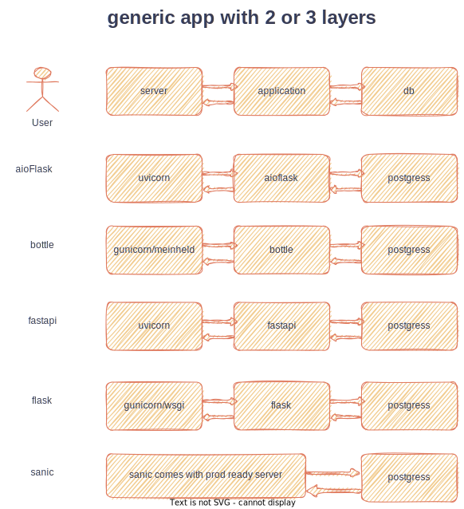

## This is to benchmark and choose which framework performs better (**scalability** is at hand)

* This task is to make simple webapp to retrieve records from postgres-db
* application can be async but db interactions are handled in sync



#### TESTS - RESULTS
* K6 -- Sanic outperformed below python frameworks in prima-facie tests till now (script is in /tests folder)
* Apache Bench(ab) -- Sanic outperformed below python frameworks in prima-facie tests till now
example of ab tests
```
ab -n 10000 -c 10 -k http://0.0.0.0:3000/
```

Results will be uploaded later


### Set up --Sanic
1) Create virtual env
```
python3 -m venv senv
source senv/bin/activate

pip install psycopg2
pip install sanic
```
2) running sanic app --dev

```
cd app-sanic
sanic server.app --dev
```

3) Run load test on sanic app, one with --dev flag, one without it

Split the terminal and navigate to where loadtest-sanic.js file located
```
k6 run loadtest-sanic.js
```

### Set up --fastapi

1) install fastapi and server dependency 
vitual env is already activated above step
```
pip install fastapi
```

to run 
```
uvicorn --port 4000 main:app
```


### Set up --aioflask
```
pip install aioflask
```
```
uvicorn --port 7000 app:app 
```

## setup flask2.0 with gunicorn and wsgi

```
pip install flask gunicorn
```

```
gunicorn --bind 0.0.0.0:6000 wsgi:app
```

## setup bottle with meinheld and gunicorn

```
pip install bottle meinheld 
```

```
gunicorn  \                              
    --log-level warning  \
    --bind 0.0.0.0:3000  \
    --reuse-port  \
    --worker-class meinheld.gmeinheld.MeinheldWorker \
      bot:app
```
